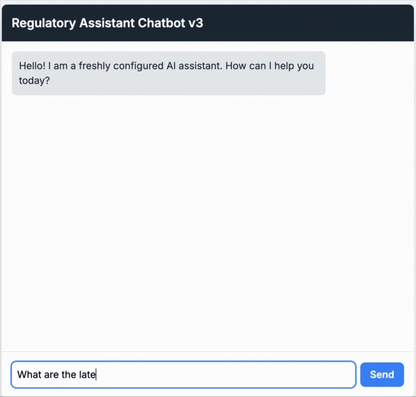

# 🏦 Azure RAG Compliance Chatbot

> A Retrieval-Augmented Generation (RAG) chatbot built with Azure AI Search and Azure OpenAI to provide verifiable, source-cited answers from private regulatory documents.

### 🎬 Live Demo

---

## 🎯 Problem Solved

Compliance officers in the BFSI sector face a significant challenge: manually searching thousands of pages of dense regulatory circulars. This manual process is slow, inefficient, and carries the risk of non-compliance due to human error.

This chatbot solves that problem by providing an intelligent, conversational interface to this private knowledge base. It uses the RAG pattern to ensure that all answers are grounded in the provided documents, delivering trustworthy and cited responses while preventing the AI from hallucinating.

---

## ✨ Key Features

- ✅ **Natural Language Queries:** Ask complex questions in plain English instead of using keywords.
- ✅ **Source-Grounded Answers:** The AI generates answers based *only* on the content of the uploaded regulatory documents.
- ✅ **Verifiable Citations:** Every answer includes references to the source document chunks, allowing for easy verification.
- ✅ **Secure & Private:** All data is processed within a private Azure environment, ensuring data confidentiality.
- ✅ **Hybrid Search:** Combines keyword search, vector search, and a semantic ranker for the highest possible accuracy.
- ✅ **Serverless Architecture:** Built entirely on managed Azure services for scalability and low maintenance.

---

## 🛠️ Tech Stack & Architecture

This project uses a modern, serverless architecture built entirely on Microsoft Azure.

 

The application follows a classic Retrieval-Augmented Generation (RAG) architecture:

graph TD
    subgraph "Data Ingestion & Indexing Pipeline"
        direction LR
        A["fa:fa-file-pdf Regulatory PDFs"] --> B["Azure Blob Storage"];
        B --> C{"Azure AI Search   Import & Vectorize Wizard"};
        C --> D["Azure AI Services   (OCR Skill)"];
        C --> E["Azure OpenAI   (Embedding Model)"];
        D --> C;
        E --> C;
        C --> F["fa:fa-search Search Index   (Chunks + Vectors)"];
    end

    subgraph "Query & Generation Pipeline"
        direction LR
        G["fa:fa-user User"] -- "1. Asks Question" --> H["fa:fa-window-maximize Web App   (index.html)"];
        H -- "2. Embeds Question" --> I["Azure OpenAI   (Embedding Model)"];
        I -- "3. Vector for Question" --> H;
        H -- "4. Hybrid Search Query" --> J["fa:fa-search Search Index   (Chunks + Vectors)"];
        J -- "5. Retrieves Relevant Chunks" --> H;
        H -- "6. Augments Prompt (Question + Chunks)" --> K["Azure OpenAI   (Chat Model)"];
        K -- "7. Generates Answer" --> H;
        H -- "8. Displays Answer" --> G;
    end

    style A fill:#d9534f,stroke:#333,stroke-width:2px
    style F fill:#5bc0de,stroke:#333,stroke-width:2px
    style J fill:#5bc0de,stroke:#333,stroke-width:2px
    style G fill:#5cb85c,stroke:#333,stroke-width:2px

